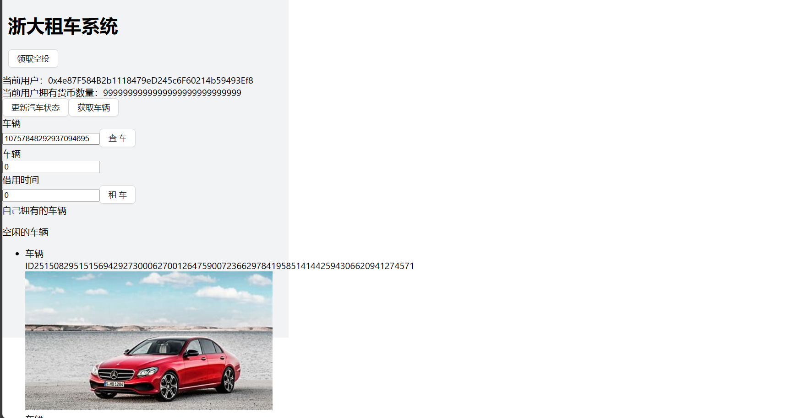

# ZJU-blockchain-course-2023

⬆ 可以️修改成你自己的项目名。

> 第二次作业要求（以下内容提交时可以删除）：
> 
> 简易汽车借用系统，参与方包括：汽车拥有者，有借用汽车需求的用户
>
> 背景：ERC-4907 基于 ERC-721 做了简单的优化和补充，允许用户对NFT进行租借。
> - 创建一个合约，在合约中发行NFT集合，每个NFT代表一辆汽车。给部分用户测试领取部分汽车NFT，用于后面的测试。
> - 在网站中，默认每个用户的汽车都可以被借用。每个用户可以： 
>    1. 查看自己拥有的汽车列表。查看当前还没有被借用的汽车列表。
>    2. 查询一辆汽车的主人，以及该汽车当前的借用者（如果有）。
>    3. 选择并借用某辆还没有被借用的汽车一定时间。
>    4. 上述过程中借用不需要进行付费。
> 
> - （Bonus）使用自己发行的积分（ERC20）完成付费租赁汽车的流程
> - 请大家专注于功能实现，网站UI美观程度不纳入评分标准，但要让用户能够舒适操作。简便起见，可以在网上找图片代表不同汽车，不需要将图片在链上进行存储。

**以下内容为作业仓库的README.md中需要描述的内容。请根据自己的需要进行修改并提交。**

作业提交方式为：**提交视频文件**和**仓库的链接**到指定邮箱。

## 如何运行

补充如何完整运行你的应用。

注意：如果想要显示图片，需要加图片的照片，然后把照片命名成汽车的名字，为了方便我应该是把显示图片的代码注释掉了，那里应该是两行代码，不知道为什么有时候一行会失效（无法显示图片），所以如果不行可以都试试（在index.tsx的288和300行）
视频有两个，一个3分钟的是正常演示步骤（无图片），另一个不到1分钟的是加了图片的

1. 在本地启动ganache应用。

2. 在 `./contracts` 中安装需要的依赖，运行如下的命令：
    ```bash
    npm install
    ```
3. 在 `./contracts` 中编译合约，运行如下的命令：
    ```bash
    npx hardhat compile
    ```
4. 在 `./contracts` 中部署合约，运行如下的命令：
    ```bash
   npx hardhat run ./scripts/deploy.ts --network ganache
   ```
   然后将部署的合约的地址写入 将输出的合约部署地址填写到`./frontend/src/utils/contract-addresses.json`中
   将`./contracts/artifacts/contracts`中的BorrowYourCar.sol/BorrowYourCar.json和对应的MyERC20.json放入到`./frontend/utils/abis`中
5. ...
6. 在 `./frontend` 中安装需要的依赖，运行如下的命令：
    ```bash
    npm install
    ```
7. 在 `./frontend` 中启动前端程序，运行如下的命令：
    ```bash
    npm run start
    ```

## 功能实现分析

简单描述：项目完成了要求的哪些功能？每个功能具体是如何实现的？

建议分点列出。
1. 查看自己拥有的汽车列表，在合约中有着用户id与拥有的汽车列表之间的映射，当加入汽车时会对此进行更新
2. 查看当前还没有被借用的汽车列表，在合约中有一个未被借用的汽车列表，当加入汽车、借用汽车后会修改列表中的汽车
3. 查询一辆汽车的主人，以及该汽车当前的借用者，在合约中有一个汽车id到汽车类型之间的映射
4. 选择并借用某两还未被租借的汽车一段时间，在合约中更新汽车列表，被借用汽车的列表，还未被借用汽车的列表
5. 用自己的货币MyERC20进行交易

## 项目运行截图

放一些项目运行截图。

项目运行成功的关键页面和流程截图。主要包括操作流程以及和区块链交互的截图。

运行项目，若在网页中出现如下错误，关闭即可，不影响正常功能


进入网页后，还无账户连接


连接上账户后


点击领取空投可领取自己发行的货币


点击更新汽车状态可以更新汽车
点击获取车辆可以在当前账户上增加一辆车（图片我现在专门注释掉没有显示如果想显示图片可以）


查询车


然后借用车1小时，再查询该车辆，可以看到用户货币也减少了1


下图是有图片的场景


## 参考内容

- 课程的参考Demo见：[DEMOs](https://github.com/LBruyne/blockchain-course-demos)。

- ERC-4907 [参考实现](https://eips.ethereum.org/EIPS/eip-4907)

如果有其它参考的内容，也请在这里陈列。
